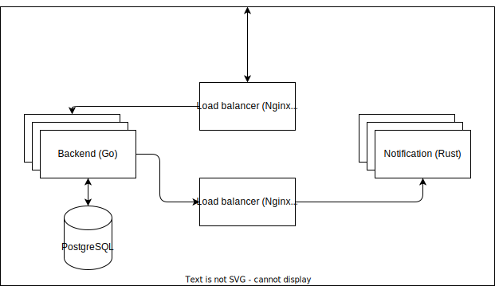

_In progress_

# To Do Application

This is a simple to do application that allows users to create, read, update and delete tasks.
It uses Go (with Gin) as the backend server and Rust for a notification server.

The idea here is to demonstrate skills in both languages and in scaling applications.

It's a very simple server with the following design.




There are many things to expand on this project including the following.
- Logging / Tracing
- Error Handler
- Authentication
- Authorization

## Development

Build the project with Docker container and use the `tests/postman_collection.json` to test the endpoints.

```bash
# Assuming you have docker 
# and docker compose 
# are installed and running
docker compose up
```

##### _If you want to scale your application just change `replicas: 2` to the number of container you want on `./notification/docker-compose.yml` or `./to-do/docker-compose.yml` based on the application you want increase._